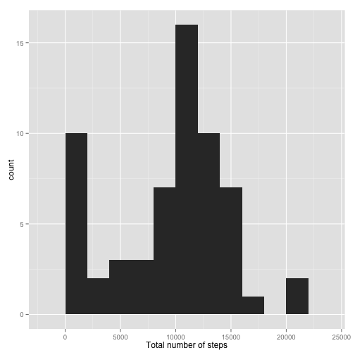
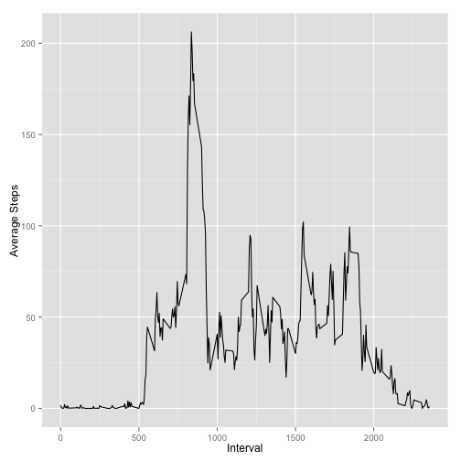
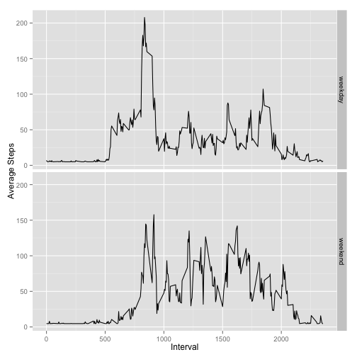

## Loading and preprocessing the data


```r
# Import required libraries
library(lubridate)
library(readr)
library(dplyr)
library(ggplot2)

# Read in data
if (!file.exists("activity.csv")) {
    unzip("activity.zip")
}
dat <- read_csv("activity.csv", col_names = TRUE, col_types = "ncn")
# Convert date and interval to R objects
dat$date <- ymd(dat$date)
```
## What is mean total number of steps taken per day?

```r
# Get sum of steps per day and plot
x <- dat %>% 
     group_by(date) %>%
     summarise(Sum = sum(steps, na.rm = TRUE))
ggplot(x, aes(x = Sum)) + 
    xlab("Total number of steps") + 
    geom_histogram(binwidth = 2000)
```

 

```r
# Get mean of steps per day 
mean(x$Sum, na.rm = TRUE)
```

```
## [1] 9354.23
```

```r
# Get mean of steps per day and plot
median(x$Sum, na.rm = TRUE)
```

```
## [1] 10395
```
## What is the average daily activity pattern?

```r
ave <- dat %>% 
       group_by(interval) %>%
       summarise(Average = mean(steps, na.rm = TRUE))
ggplot(ave, aes(x = interval, y = Average)) + 
    xlab("Interval") + ylab("Average Steps") +
    geom_line()
```

 

```r
# The 5-min time interval contains the maximum number of steps
ave %>% 
    filter(Average == max(Average)) %>% 
    select(interval) %>% 
    nth(1)
```

```
## [1] 835
```

## Imputing missing values

```r
# Calculate and report the total number of missing values in the dataset 
# (i.e. the total number of rows with NAs)
sum(!complete.cases(dat))
```

```
## [1] 2304
```

```r
# Devise a strategy for filling in all of the missing values in the dataset. 
# Use the mean for all non-NA rows because for some dates all measurements are NAs.
aveAll <- mean(dat$steps, na.rm = TRUE)
# Create a new dataset that is equal to the original dataset but with the missing data filled in.
dat[!complete.cases(dat),]$steps <- aveAll
# Make a histogram of the total number of steps taken each day
y <- dat %>% 
     group_by(date) %>%
     summarise(Sum = sum(steps, na.rm = TRUE))
ggplot(y, aes(x = Sum)) + 
    xlab("Total number of steps") + 
    geom_histogram(binwidth = 2000)
```

 

```r
# Calculate and report the mean and median total number of steps taken per day
# Get mean of steps per day 
mean(y$Sum, na.rm = TRUE)
```

```
## [1] 10766.19
```

```r
# Get mean of steps per day and plot
median(y$Sum, na.rm = TRUE)
```

```
## [1] 10766.19
```
## Are there differences in activity patterns between weekdays and weekends?

```r
# Create a new factor variable with two levels – “weekday” and “weekend”
dat$day <- as.factor(ifelse(weekdays(dat$date) %in% c("Saturday","Sunday"),
                    "weekend","weekday"))
w <- dat %>%
     group_by(day, interval) %>%
     summarise(Average = mean(steps))
ggplot(w, aes(x = interval, y = Average)) + 
    xlab("Interval") + ylab("Average Steps") +
    geom_line() + 
    facet_grid(day ~ .)
```

 
